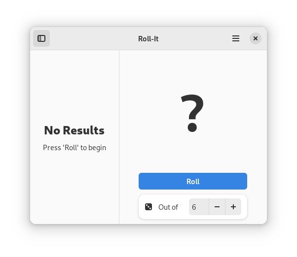

# Roll-It

Roll a six-sided die by default, or roll a custom die of up to one-hundred sides.

## Installation

The latest stable release of Roll-It is available via Flathub.

Any version distributed elsewhere is not provided nor supported by me.

## Building

Roll-It is built using GTK4 and libadwaita with the GNOME HIG in mind.

If you would like to build and hack on Roll-It, it is highly recommended to use [GNOME Builder](https://gitlab.gnome.org/GNOME/gnome-builder/).

Manual build instructions to come later.

## Credits

Other GTK Rust projects used for reference:

- [GTK Rust Template](https://gitlab.gnome.org/World/Rust/gtk-rust-template)
- [Loupe](https://gitlab.gnome.org/Incubator/loupe)
- [PikaBackup](https://gitlab.gnome.org/World/pika-backup)

