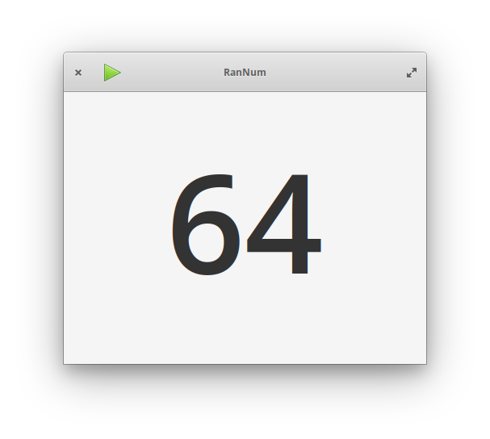

# RanNum



## Simple random number generator
Simple random number generator designed for [elementary OS].

## Building

RanNum is designed for and developed on [elementary OS]. You'll need the following dependencies to build it yourself:

* libgtk-3-dev
* meson
* valac

To install them on [elementary OS]:

```shell
sudo apt install elementary-sdk
```

To build and install RanNum:

```shell
meson build --prefix=/usr
cd build
ninja
sudo ninja install
```

[elementary OS]: https://elementary.io