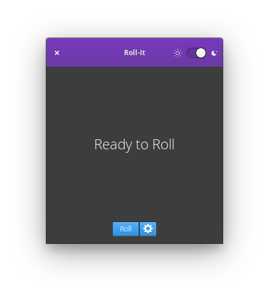

<p align="center">
  
</p>
<h1 align="center">Roll-It</h1>
<p align="center">
  <a href="https://appcenter.elementary.io/com.github.zelikos.rannum"></a>
</p>

|  |  |
|------------------------------------------|-----------------------------------------|

## Roll the dice

Simulate the results of rolling a die. Roll a six-sided die by default, or get the results of rolling a custom die with up to one-hundred sides.

## Installation

At this time, Roll-It is designed exclusively for [elementary OS], and is available for installation via AppCenter.

[][AppCenter link]

Any version distributed elsewhere is not provided nor supported by me.

## Building

Roll-It is designed for and developed on [elementary OS]. You'll need the following dependencies to build it yourself:

* libgranite-dev
* libgtk-3-dev
* meson
* valac

To install them on [elementary OS]:

```shell
sudo apt install elementary-sdk
```

To build and install Roll-It:

```shell
meson build --prefix=/usr
cd build
ninja
sudo ninja install
```

[elementary OS]: https://elementary.io
[AppCenter link]: https://appcenter.elementary.io/com.github.zelikos.rannum
