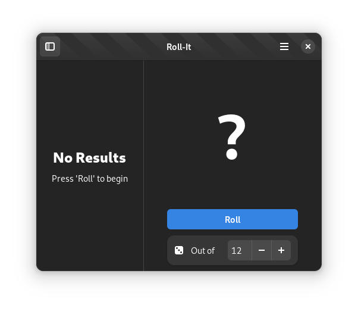

<!-- <p align="center">
  
</p> -->
<h1 align="center">Roll-It</h1>

|  |  |
|------------------------------------------|-----------------------------------------|

## Roll the dice

Simulate the results of rolling a die. Roll a six-sided die by default, or get the results of rolling a custom die with up to one-hundred sides.

## Installation

Roll-It's latest stable release is available via the [elementary OS] AppCenter.

[][AppCenter link]

Any version distributed elsewhere is not provided nor supported by me.

## Building

Roll-It has been rewritten for GTK4 and libadwaita, aligning more with GNOME's HIG. This version is under active development, although there are still plans to build GTK4 Roll-It on the elementary OS platform in the future.

### Flatpak

For the current development build, make sure you have the required Flatpak remote enabled:

```shell
flatpak remote-add --if-not-exists --user gnome-nightly https://nightly.gnome.org/gnome-nightly.flatpakrepo
```

From there, it is highly recommended to use [GNOME Builder](https://gitlab.gnome.org/GNOME/gnome-builder/) to build and test Roll-It.

Instructions for building the Flatpak manually will come later.

[elementary OS]: https://elementary.io
[AppCenter link]: https://appcenter.elementary.io/com.github.zelikos.rannum
