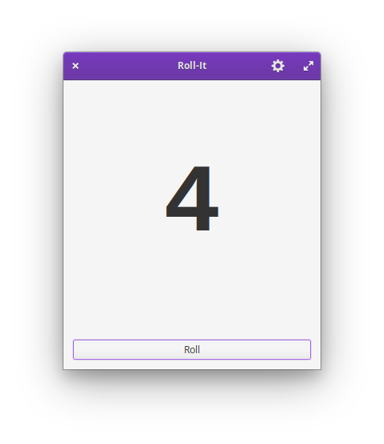
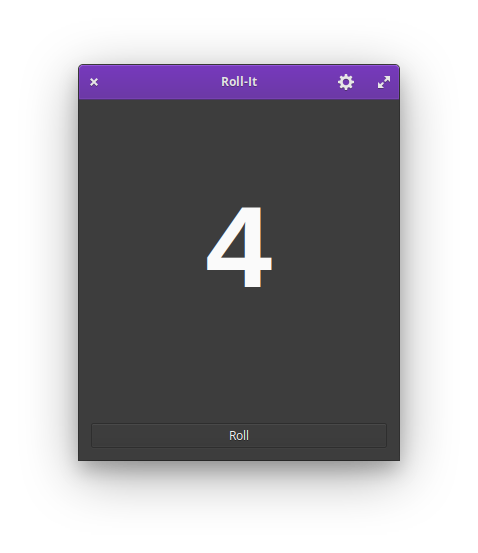

<h1 align="center">Roll-It</h1>

|  |  |
|-------------------------------------------|------------------------------------------|

## Roll the dice

Simple dice-rolling app designed for [elementary OS].

## Building

Roll-It is designed for and developed on [elementary OS]. You'll need the following dependencies to build it yourself:

* libgranite-dev
* libgtk-3-dev
* meson
* valac

To install them on [elementary OS]:

```shell
sudo apt install elementary-sdk
```

To build and install Roll-It:

```shell
meson build --prefix=/usr
cd build
ninja
sudo ninja install
```

[elementary OS]: https://elementary.io
