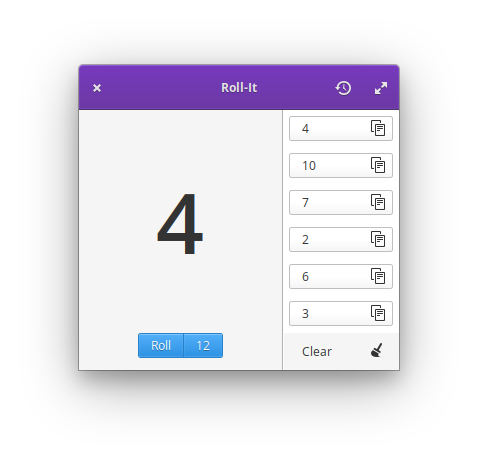
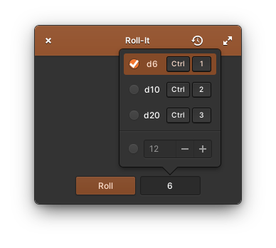

<p align="center">
  
</p>
<h1 align="center">Roll-It</h1>
<p align="center">
  <a href="https://appcenter.elementary.io/com.github.zelikos.rannum"></a>
</p>

|  |  |
|------------------------------------------|-----------------------------------------|

## Roll the dice

Simulate the results of rolling a die. Roll a six-sided die by default, or get the results of rolling a custom die with up to one-hundred sides.

This branch is a highly experimental port to GTK4; many features are still non-functional.

## Installation

Roll-It is designed and developed primarily for [elementary OS]. The latest stable release is available via AppCenter.

[][AppCenter link]

Any version distributed elsewhere is not provided nor supported by me.

## Building

### Flatpak

This branch is for experimental support for building on ARM devices like the Pinebook Pro.

Because the elementary Flatpak runtime currently does not build for aarch64, this branch leverages the GNOME platform and Flathub instead.

<!--First, install the elementary Flatpak runtime & SDK:-->

<!--```shell-->-->
<!--flatpak remote-add --if-not-exists appcenter https://flatpak.elementary.io/repo.flatpakrepo-->
<!--flatpak install appcenter io.elementary.Platform io.elementary.Sdk-->
<!--```-->

First, install Flathub and the GNOME runtime and SDK:
```shell
flatpak remote-add --if-not-exists flathub https://flathub.org/repo/flathub.flatpakrepo
flatpak install flathub org.gnome.Platform/aarch64/40 org.gnome.Sdk/aarch64/40
```

Then, to build and install Roll-It:

```shell
flatpak-builder build com.github.zelikos.rannum.yml --user --install --force-clean
```

### Distro Packages

You'll need the following dependencies to build Roll-It yourself:

* libgranite-dev
* libgtk-3-dev
* libhandy-1-dev
* meson
* valac

If running [elementary OS], the simplest way is to install the elementary SDK:

```shell
sudo apt install elementary-sdk
```

To install only the required dependencies, or to install them on Ubuntu:

```shell
sudo apt install libgranite-dev libgtk-3-dev libhandy-1-dev meson valac
```

To install them on Fedora:

```shell
sudo dnf install granite-devel gtk3-devel libhandy-devel meson vala
```

To build and install Roll-It:

```shell
meson build --prefix=/usr
cd build
ninja
ninja install
```

[elementary OS]: https://elementary.io
[AppCenter link]: https://appcenter.elementary.io/com.github.zelikos.rannum
