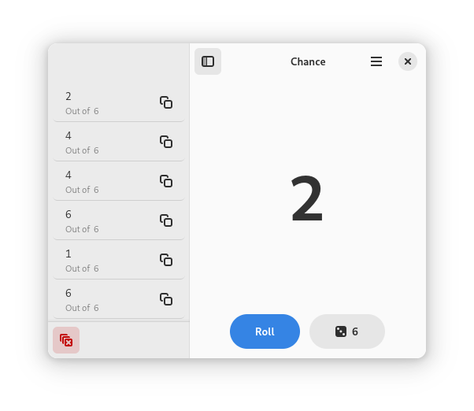

# Chance

Roll six-sided dice by default, or roll custom dice of up to 999 sides.

## Installation

The latest stable release of Chance is available via Flathub.

Any version distributed elsewhere is not provided nor supported by me.

## Building

Chance is built using GTK4 and libadwaita with the [GNOME HIG](https://developer.gnome.org/hig/) in mind.

If you would like to build and hack on Chance, it is highly recommended to use [GNOME Builder](https://flathub.org/apps/org.gnome.Builder).

Manual build instructions to come later.

## Source Code

The source code for Chance is available on both [GitHub](https://github.com/zelikos/rannum) and [Codeberg](https://codeberg.org/zelikos/chance).

## Credits

Other GTK Rust projects used for reference:

- [GTK Rust Template](https://gitlab.gnome.org/World/Rust/gtk-rust-template)
- [Loupe](https://gitlab.gnome.org/Incubator/loupe)
- [PikaBackup](https://gitlab.gnome.org/World/pika-backup)
- [Amberol](https://gitlab.gnome.org/World/amberol)
